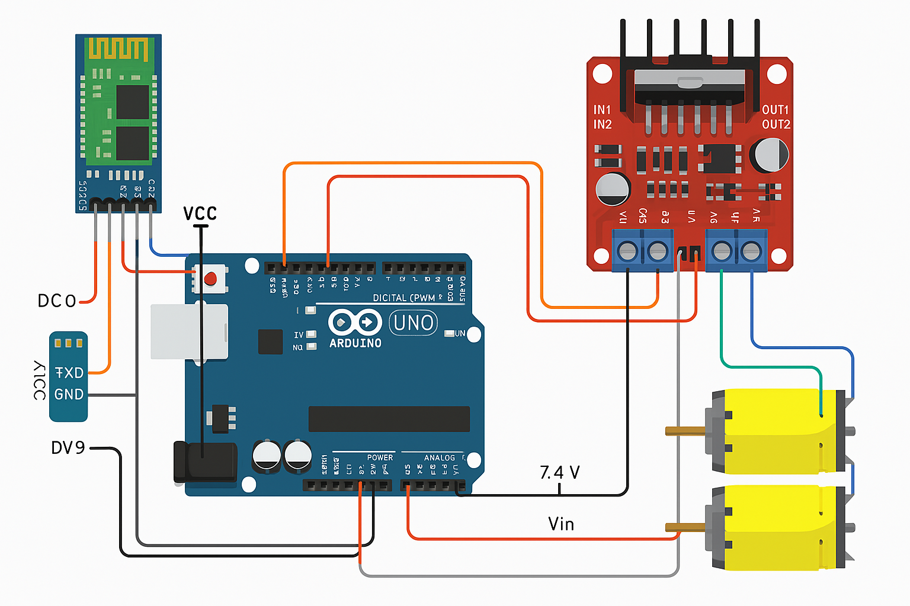
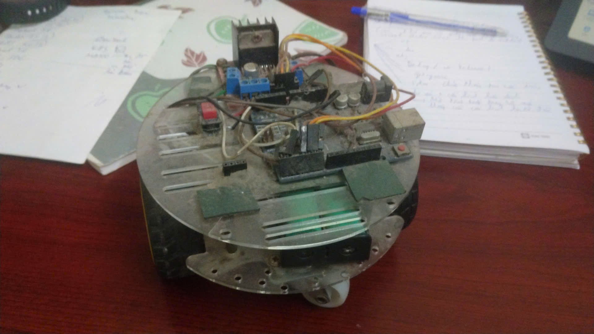

# 🤖 Arduino Bluetooth-Controlled Robot Car

## 🛠️ Tools Used

- 🧠 **Arduino Programming** (Arduino IDE)
- 📱 **MIT App Inventor** (for building the mobile control app)

## 🔩 Components

- 🔌 Arduino Uno R3  
- ⚙️ L298N Motor Driver Module  
- 📶 HC-05 Bluetooth Module  
- 🔁 Two DC Motors  
- 🔋 7.4V Power Supply  
- 📱 Android Smartphone

## 📋 Project Description

This project demonstrates how to control a robot car using an Arduino Uno R3 and an Android mobile application created with MIT App Inventor. The car receives commands via Bluetooth from a mobile device and moves accordingly by controlling two DC motors through the L298N motor driver module.

### 🔧 L298N Motor Driver Connections:

- **OUT3 and OUT4** → Motor 1  
- **OUT1 and OUT2** → Motor 2  
- **VCC** → 7.4V Power Supply  
- **5V Pin** → Connected to `VIN` of Arduino Uno R3 (to power the Arduino)  
- **IN1, IN2, IN3, IN4** → Connected to Arduino digital pins `D6`, `D7`, `D8`, and `D9` respectively (for motor control)

### 📡 HC-05 Bluetooth Module Connections:

- **TXD (Bluetooth)** → Connected to `D4` (RX of Arduino)  
- **RXD (Bluetooth)** → Connected to `D3` (TX of Arduino)  

### 🧠 Arduino Uno R3:

- Programmed to interpret signals received via the HC-05 Bluetooth module and control the DC motors accordingly using the L298N module.

### 📲 MIT App Inventor:

- Used to create a mobile app that sends control signals to the Arduino over Bluetooth (e.g., move forward, backward, turn left, right, or stop).

## 🚀 How It Works

1. The mobile app connects to the HC-05 Bluetooth module.
2. The user sends commands via buttons in the app.
3. Arduino reads the incoming signals and triggers the appropriate motor control logic.
4. The L298N module drives the motors based on Arduino's commands, enabling the robot car to move.

## 👀 Preview

I've been working on this project for a long time so it's old now 😅  

## 📄 License

This project is open-source and free to use for educational purposes.

